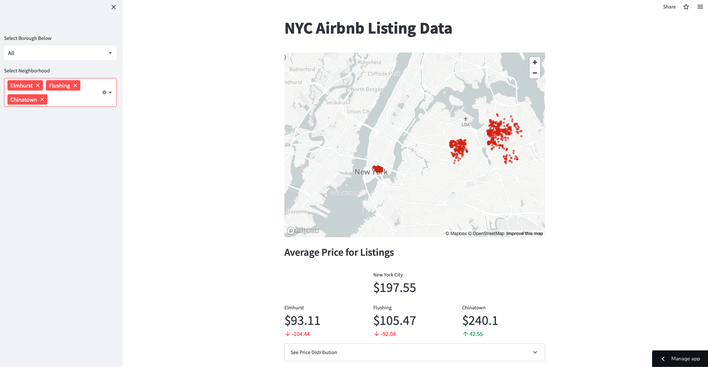

# NYC-Airbnb-Listing-Data-Visualization-App

## Project Description

Create a web app that shows insight on New York City Airbnb listings with visualizations

## Python Libaries Used

Pandas, Numpy, Matplotlib, and Streamlit

## Data Source

[Inside Airbnb](http://insideairbnb.com/get-the-data)
> A catlog of data of Airbnb from around the world updated quarterly

## File Directory
- ### app.py 
  > Location of the code for the web app and visualizations
- ### listings.csv
  > Location of the the 09-07-22 data for NYC
- ### requirements.txt
  > Text file with details on enviroment requirements for the web app

## Future Updates

> To be determined
